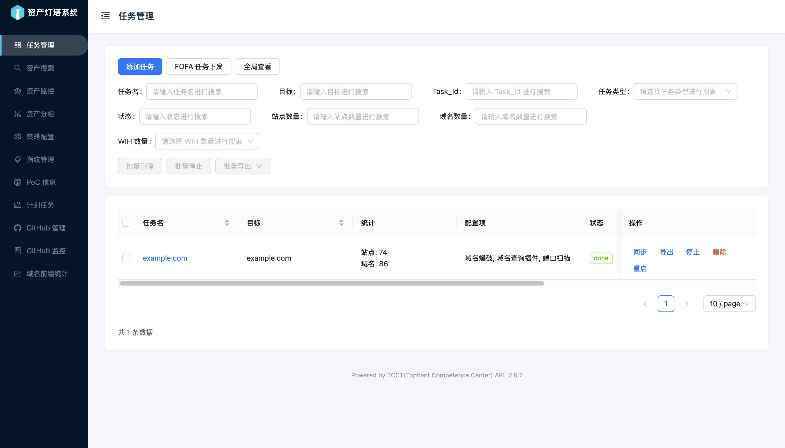

# ARL 资产侦察灯塔系统 - Vue 3 前端

[](https://v3.vuejs.org/)
[](https://antdv.com/)
[](https://webpack.js.org/)
[](https://opensource.org/licenses/MIT)

---

## 🔥 项目使命

**延续 ARL 的生命周期** - 本项目是 [ARL 资产侦察灯塔系统](https://github.com/TophantTechnology/ARL) 的前端源码复刻版本，旨在：

- 🔄 **技术升级**：从传统技术栈迁移到现代化的 Vue 3 + Ant Design Vue 4
- 🏗️ **架构重构**：采用组件化开发，提升代码可维护性和扩展性
- 🌟 **用户体验**：提供更直观、美观、响应式的用户界面
- 📦 **开源延续**：确保 ARL 系统的功能和精神在新技术栈上延续

---

## 🤖 AI 生成声明

⚠️ **重要提示**：本项目代码完全由 AI 生成，使用先进的代码生成技术创建。这是一个实验性项目，展示了AI在现代化前端开发中的能力。

**AI 生成的优势：**
- 🚀 **快速原型**：能够在短时间内生成完整的应用架构
- 🎯 **最佳实践**：遵循现代前端开发的最佳实践和设计模式
- 🔧 **一致性**：代码风格和结构高度一致
- 📈 **可扩展性**：模块化设计便于后续维护和扩展

**注意事项：**
- 本项目仅供学习和研究目的
- 生产环境使用前请进行充分测试和代码审查
- AI生成的代码可能需要根据具体需求进行调整
- 推荐使用现代浏览器访问以获得最佳体验

---

## 🚧 项目状态

**⚠️ 注意：** 本项目仍在积极开发中，部分功能可能尚未完成或存在 Bug。欢迎通过 Issue 和 Pull Request 参与贡献！
AI 审核 PR[旺柴]
---

ARL (Asset Reconnaissance Lighthouse) 资产侦察灯塔系统的现代化前端界面，基于 Vue 3 + Ant Design Vue 4 重构，提供直观、美观的用户体验。

## 📸 项目界面

### 🎨 登录界面


### 🏠 主界面预览


## 🚀 快速开始

### 环境要求
- Node.js >= 16.0.0
- npm >= 8.0.0

### 安装依赖
```bash
npm install
```

### 开发环境
```bash
npm run dev
```
启动开发服务器，访问 http://localhost:5173

### 生产构建
```bash
npm run build
```
构建生产版本，输出到 `dist/` 目录

## 🛠 技术栈

### 前端框架
- **Vue 3.4** - 渐进式JavaScript框架
- **Vue Router 4** - 官方路由管理器
- **Vuex** - 状态管理（计划集成）

### UI组件库
- **Ant Design Vue 4** - 企业级UI组件库
- **@ant-design/icons-vue** - Ant Design图标库

### 构建工具
- **Webpack 5** - 模块打包器
- **Babel** - JavaScript编译器
- **Less** - CSS预处理器

### HTTP客户端
- **Axios** - HTTP客户端库


## 📄 许可证

本项目仅供学习和研究使用，请勿用于商业用途。

## 🙋‍♂️ 支持

如有问题或建议，请通过以下方式联系：
- 提交 Issue
- 发起 Pull Request
- 参与项目讨论

---

*本项目是ARL资产侦察灯塔系统的开源复刻版本，旨在延续其生命周期并提供更好的用户体验和现代化技术栈。通过Vue 3的现代化重构，我们希望能让ARL的精神和功能在新的技术时代继续发光发热。*

